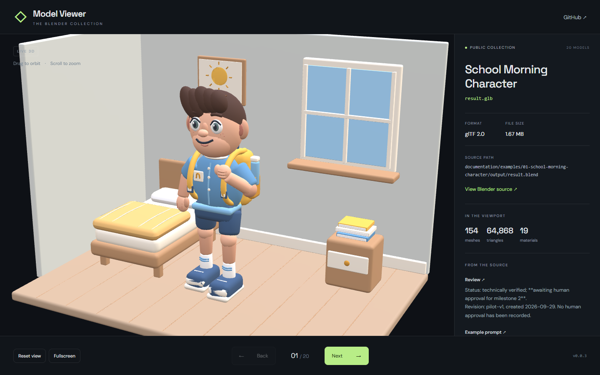

# Model Viewer

A full-browser 3D gallery for the public [AI Skills for Blender collection](https://github.com/SamuelAsherRivello/ai-skills-blender). Browse scenes and historical variants with Back and Next, orbit and zoom, play animations, and inspect filenames, geometry statistics, and documented metadata.



## Live Demo

[Open Model Viewer](https://samuelasherrivello.github.io/ai-skills-blender-model-viewer/) · [Latest release](https://github.com/SamuelAsherRivello/ai-skills-blender-model-viewer/releases/latest)

## Getting Started

Use Node.js 24 or later and npm. Run from the repository root:

```sh
npm ci
npm run dev
npm test
npm run build
npm run check:distribution
npm run preview
```

Open the Vite URL at `/ai-skills-blender-model-viewer/`. Internet access and WebGL are required. No API key or environment file is needed.

For full browser acceptance, install Google Chrome, then run `npm run test:browser`. This checks every current public model, error/retry states, navigation, metadata, animation controls, and a narrow viewport. Set `VIEWER_URL` to test a deployed URL instead of the local Vite server. Public assets are downloaded by the browser; none are committed or bundled.

## Model Sourcing

Each page load resolves the source repository's public `main` commit once. It fetches `documentation/models/index.json` and the selected GLB at that immutable revision. Reload to discover newly published models without rebuilding the viewer. Models are sorted by full source path, so repeated filenames and historical variants remain distinct.

The source repository owns model exports, catalog generation, and metadata extraction. See its [export maintenance guide](https://github.com/SamuelAsherRivello/ai-skills-blender/blob/main/documentation/models/README.md). The catalog records provenance for each documented value. Measured viewport statistics are shown separately. Missing metadata is omitted; remote text is rendered as plain text.

The viewer uses React, Vite, and Babylon.js. Camera framing comes from the source scene when available, with a bounds-based fallback. Blender lighting and compositing are replaced with neutral viewer lighting. Procedural colors/normals use baked textures; toon shading is approximated with the authored palette. Export notes disclose these differences. The largest environment uses lossless meshopt compression and can take longer to load. A failed model can be retried or skipped.

GitHub's public API limits and network outages produce visible retry states. Model downloads use `raw.githubusercontent.com`; Babylon's public CDN supplies the lighting environment and meshopt decoder, and Google Fonts supplies typography.

## Releases

Normal pushes and pull requests run checks only. To publish:

1. Push reviewed changes to `main`.
2. Run **Release** in GitHub Actions with `existing_version` blank.
3. Tests, build, and distribution checks must pass before allocating the next patch version.
4. The workflow commits `version.txt`, creates the matching annotated tag, builds that exact commit, uploads `release.zip`, deploys it to GitHub Pages, and publishes the release after deployment succeeds.

The app version, `version.txt`, tag, and release agree. Pages hosts the latest successful deployment. App releases contain only the application, never models or a copied model catalog.

Re-run a failed workflow to resume its allocated version. To retry or roll back a specific release, dispatch **Release** with its existing `vX.Y.Z` tag. This checks out that tag without allocating another patch. Source models still resolve independently from the public source on reload.

## Project Layout

- `model-viewer/src/`: React interface, catalog validation, and Babylon lifecycle.
- `model-viewer/test/`: catalog, distribution, release-allocation, and project checks.
- `model-viewer/browser/`: real-browser acceptance against public assets.
- `model-viewer/scripts/`: release version allocation and distribution guard.
- `model-viewer/documentation/`: screenshot and delivery evidence.
- `.github/workflows/`: checks and manual release/Pages deployment.
- `openspec/`: project constraints and feature specifications.

## Credits

<!-- AI: Preserve established attribution and ownership. Customize the following subsections only from confirmed contributor, contact, and license information; do not infer a new owner from the repository name. -->
### 💡 Contributors

<!-- AI: Preserve existing contributor credit and add contributors only when confirmed. Do not automatically advance experience counts or their reference year. -->
- Samuel Asher Rivello - Over 25 years of game development XP (2026)

### 💡 Contact

<!-- AI: Preserve confirmed contact destinations and their order unless requested otherwise. Use readable display URLs without a protocol or trailing slash while keeping the real link target intact. Do not invent accounts or change target capitalization based on display styling. -->
- [LinkedIn.com/in/SamuelAsherRivello](https://Linkedin.com/in/SamuelAsherRivello) ⭐ 
- [GitHub.com/SamuelAsherRivello](https://github.com/SamuelAsherRivello/)
- [Twitter.com/srivello](https://twitter.com/srivello/)
- Resume / Portfolio: [SamuelAsherRivello.com](http://www.SamuelAsherRivello.com)


### 💡 License

<!-- AI: Keep the license name linked to the actual relative license file and verify that its terms match this statement. Keep the copyright holder and year consistent with that file. Do not change license terms, ownership, or dates without an explicit request. -->
- Provided as-is under the [MIT License](LICENSE).

- Copyright © 2026 Rivello Multimedia Consulting, LLC.
